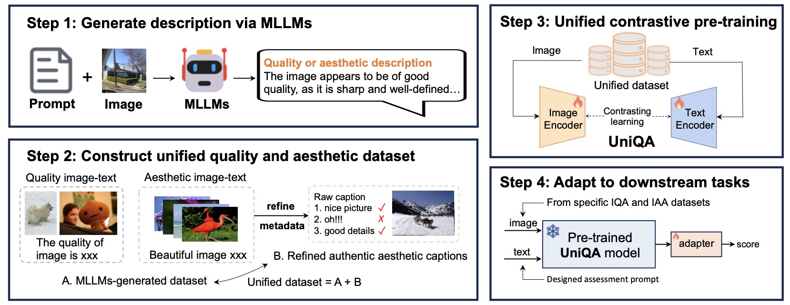
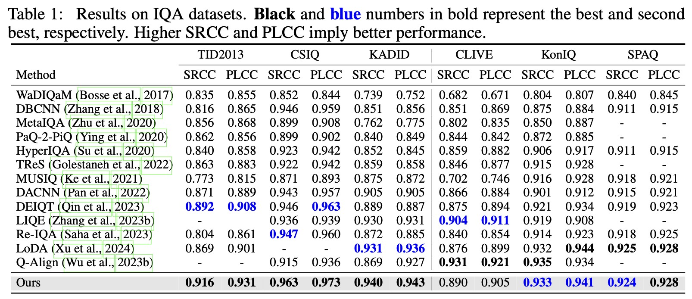
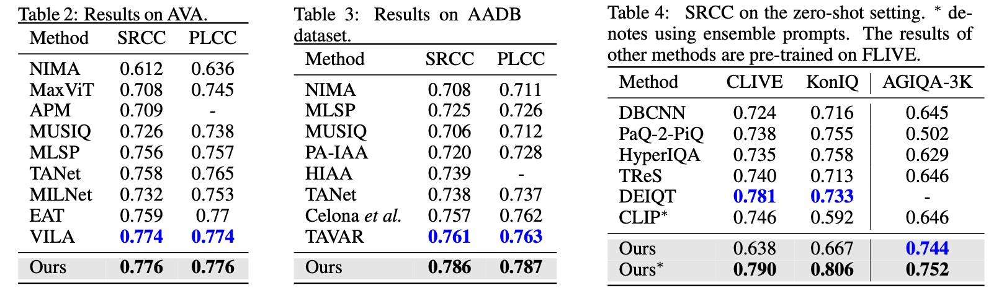
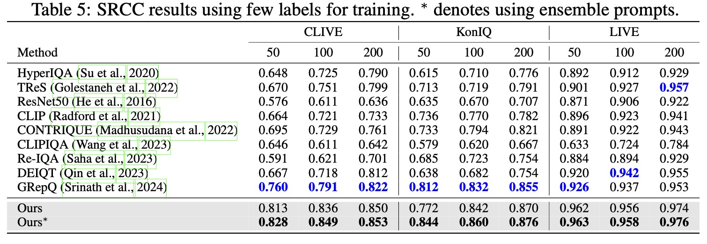

# UniQA: Unified Vision-Language Pre-training of Quality and Aesthetics [paper](https://arxiv.org/abs/2406.01069)

## :loudspeaker: Abstract

Image Quality Assessment (IQA) and Image Aesthetic Assessment (IAA) aim to simulate human subjective perception of image visual quality and aesthetic appeal.
Despite distinct learning objectives, they have underlying interconnectedness due to consistent human assessment perception. Existing unified methods typically combine datasets of two tasks for regression training directly, which fail to learn mutually beneficial representations shared by both tasks explicitly. To confront this challenge, we propose Unified vision-language pre-training of Quality and Aesthetics (UniQA), to extract useful and common representations from two tasks, thereby benefiting them simultaneously. Unfortunately, the lack of text in the IQA datasets and the textual noise in the IAA datasets pose severe challenges for multimodal pre-training. To address this, we (1) utilize multimodal large language models (MLLMs) to generate high-quality text descriptions; (2) use the generated text for IAA  as metadata to purify noisy IAA data. To effectively adapt the pre-trained UniQA to downstream tasks, we further propose a lightweight adapter that utilizes versatile cues to fully exploit the extensive knowledge of the pre-trained model. Extensive experiments show that our approach achieves state-of-the-art performance on both IQA and IAA tasks, while also demonstrating exceptional few-label image assessment capabilities. 




## :trophy: Result

Our UniQA can achieve SOTA performance on both IQA and IAA tasks.




More impressively, our UniQA achieves significant improvements on few-label IQA tasks.



Our UniQA also achieve competitive results on AIGC IQA datatset AIGIQA-20K, the enhanced colonoscopy image quality assessment dataset (ECIQAD) and the AI-Generated Image Naturalness (AGIN) dataset. Please note that these results are not included in the current ARVIX version. We will update the ARXIV paper soon.

## :open_file_folder: Weight
We release the UniQA pre-trained weight, multimodal IQA and IAA dataset.  **You may need to log out of your Google account to download them.**

 - UniQA image-text dataset: [Google Drive](https://drive.google.com/file/d/1I9wjwiDBwxGFOQaMEsxnEuX58SrpoJbe/view?usp=sharing); 
 [BaiduNetDisk](https://pan.baidu.com/s/1DZP8AHC7p3WF62yM58xEqg?pwd=2shh)(code: 2shh)

 - UniQA weight: [Google Drive](https://drive.google.com/file/d/1stL1EqYvjkThGDpfPWRQzvbA780FKM4n/view?usp=sharing); 
 [BaiduNetDisk](https://pan.baidu.com/s/1XB55QtbimMojGDIJ8h8UnA?pwd=tnnq)(code: tnnq)

 - Meta_info (also can be found in [IQA-Pytorch](https://github.com/chaofengc/IQA-PyTorch)): [Google Drive](https://drive.google.com/file/d/1XldiIPXm3Z86-WIHAJhpD5LYvBSxj6Lt/view?usp=sharing); 
 [BaiduNetDisk](https://pan.baidu.com/s/1dCW3ux9kUtv7uoMazeCv9A?pwd=m5z7)(code: m5z7)

## 🚀 Training
More detail please see [IQA-PyTorch](https://github.com/chaofengc/IQA-PyTorch).
```
python train.py -opt options/train/UniQA/livec.yml 
```

Our model can be found in `pyiqa/archs/uniqa_arch.py`

We also include a simple version of CLIP training (see `train_clip` dir). We recommend using [open_clip](https://github.com/mlfoundations/open_clip) to train clip, which will be more efficient.

## 📚  Citation
Please cite our work if you find our work and codes helpful for your research.
```
@article{zhou2024uniqa,
  title={UniQA: Unified Vision-Language Pre-training for Image Quality and Aesthetic Assessment},
  author={Zhou, Hantao and Tang, Longxiang and Yang, Rui and Qin, Guanyi and Zhang, Yan and Hu, Runze and Li, Xiu},
  journal={arXiv preprint arXiv:2406.01069},
  year={2024}
}
```

## Acknowledgement

This project is built upon numerous previous projects. We'd like to thank the contributors of [IQA-PyTorch](https://github.com/chaofengc/IQA-PyTorch).
